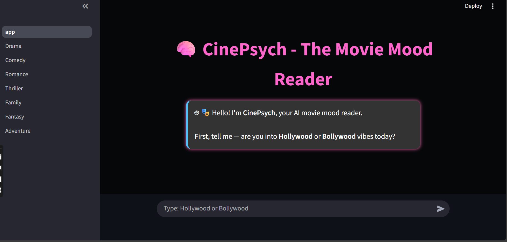

Absolutely! Here's a complete and **clean README.md** for your project **"CinePsych 🎬🧠"**, built for the **Qloo API Hackathon**, with an engaging project description, feature list, tech stack, setup instructions, and demo section.

---

### ✅ `README.md`

```markdown
# 🎬🧠 CinePsych — The Movie Mood Reader

**CinePsych** is a fun and emotionally intelligent AI chatbot that reads your *mood*, asks you playful questions, and recommends a movie that matches your feelings — along with a poetic one-liner and a cinematic shayari.

> Built with 💡 Together AI + Qloo API for the [FixInfra/Qloo Hackathon].

---

## 🌟 What It Does

🧠 **Reads your mood** through a friendly chat  
🎭 **Asks dynamic, LLM-generated questions** based on your answers  
🎥 **Recommends a movie** that matches your vibe using the Qloo API  
🎙️ **Generates a dramatic one-liner** for the movie  
📜 **Adds poetic shayari** (in Hindi or English, based on Bollywood/Hollywood selection)  
🖼️ Beautiful **chat-like UI** with Netflix-style movie cards

---

## 📸 Demo



> Live demo coming soon on Streamlit Cloud!

---

## 🔧 Tech Stack

- **Frontend:** Streamlit (with custom CSS)
- **LLM API:** Together AI (`Mixtral-8x7B-Instruct`)
- **Movie Data:** Qloo API (via genre tags)
- **Language Detection:** Based on user's Bollywood/Hollywood choice
- **Poetry/Quotes:** Generated using LLM (English or Hindi)

---

## 📁 Folder Structure

```

.
├── app.py                     # Main Streamlit app
├── utils.py                  # LLM, genre, mood logic
├── qloo\_client.py            # Qloo API client logic
├── assets/                   # Background image or screenshots
├── .env                      # Contains API keys (ignored)
├── .gitignore
└── requirements.txt

````

---

## 🚀 How to Run Locally

### 1. Clone the repo

```bash
git clone 
cd cinepsych
````

### 2. Install dependencies

```bash
pip install -r requirements.txt
```

### 3. Add your `.env` file

```
TOGETHER_API_KEY=your_together_ai_key
QLOO_API_KEY=your_qloo_key
```

### 4. Run the app

```bash
streamlit run app.py
```

---

## ✨ Unique Features

* Real-time **emotion inference** from open-ended responses
* LLM-powered **dynamic question generation**
* Hindi/English **shayari generation**
* **Fallback recovery** if mood prediction fails
* Designed for **fun, emotion, and engagement**

---

## 🏆 Built For

This project was submitted for the **Qloo API **


